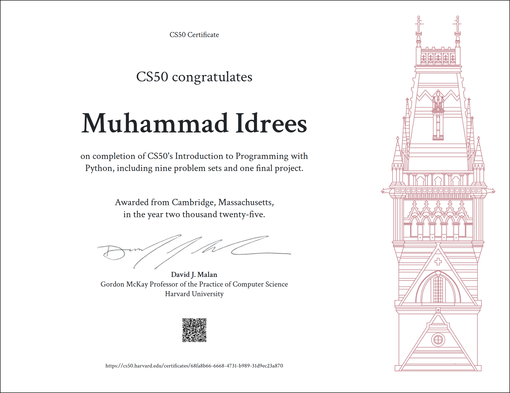

# CS50 Introduction to Python 🐍

This repository contains my solutions and practice programs from *Harvard CS50 – Introduction to Python*.

## 📜 Certificate

## 📂 Projects Included
- camel.py – Convert camelCase to snake_case
- fuel.py – Fuel gauge problem
- grocery.py – Grocery list counter
- emoji.py – Emoji conversion
- bank.py – Greeting-based response
- bitcoin.py – Bitcoin price calculator
- adieu.py – Farewell generator

## 🧠 Skills Learned
- Python fundamentals
- Functions & conditionals
- Loops
- String manipulation
- File handling
- Problem solving

## 👤 Author
*Idrees Ibrahim*  
CS50 Python Graduate  
GitHub: https://github.com/idreesibrahimg
